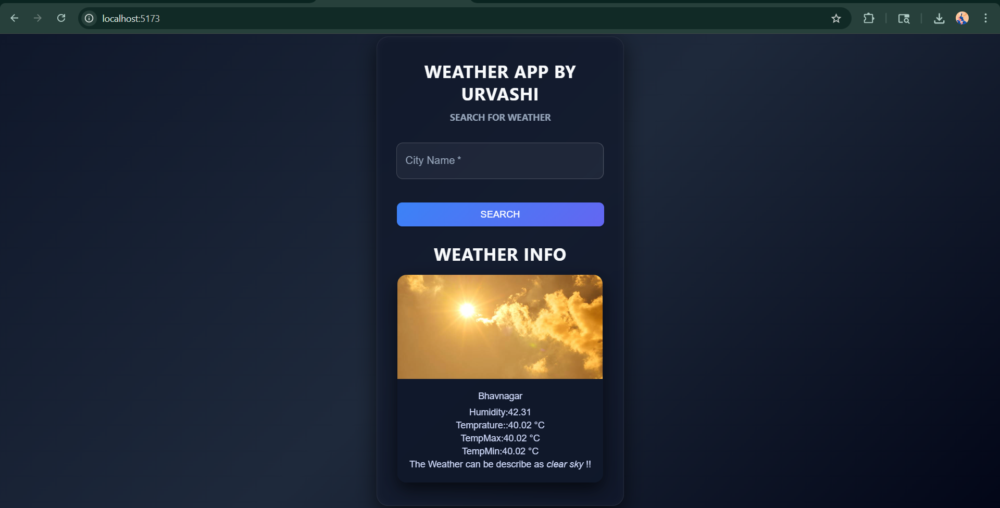

# 🌦️ Weather App

A modern React weather application with a clean dark UI that displays real-time weather data for any city.

---

## 📸 Preview


## 🚀 Features

* 🔍 Search weather by city name
* 🌡️ Displays temperature, humidity, minimum & maximum temperature
* 🌤️ Dynamic weather visuals based on conditions
* 🎨 Clean and responsive dark UI
* ⚡ Fast performance using Vite

---

## 🛠️ Tech Stack

* React.js
* Vite
* Material UI
* OpenWeather API

---

## ⚙️ Setup & Installation

1. Clone the repository:

```bash
git clone https://github.com/your-username/weather-app.git
cd weather-app
```

2. Install dependencies:

```bash
npm install
```

3. Run the development server:

```bash
npm run dev
```

---

## 🔑 API Key Setup

This project uses the **OpenWeather API** to fetch real-time weather data.

### ✅ How it works:

* The app sends a request to the OpenWeather API with your API key and city name.
* The API returns weather data like temperature, humidity, and conditions.
* This data is then displayed in the UI.

### ✅ Steps to get your API key:

1. Go to: https://openweathermap.org/api
2. Sign up and generate your API key
3. Create a `.env` file in the root of your project
4. Add your API key like this:

```env
VITE_API_KEY=your_api_key_here
```

### ⚠️ Important Notes:

* Do **not** share your API key publicly
* Restart the development server after adding the `.env` file
* In Vite, environment variables must start with `VITE_`

---

## 🌐 Live Demo

*Not deployed yet*

---

## 👩‍💻 Author

Urvashi
